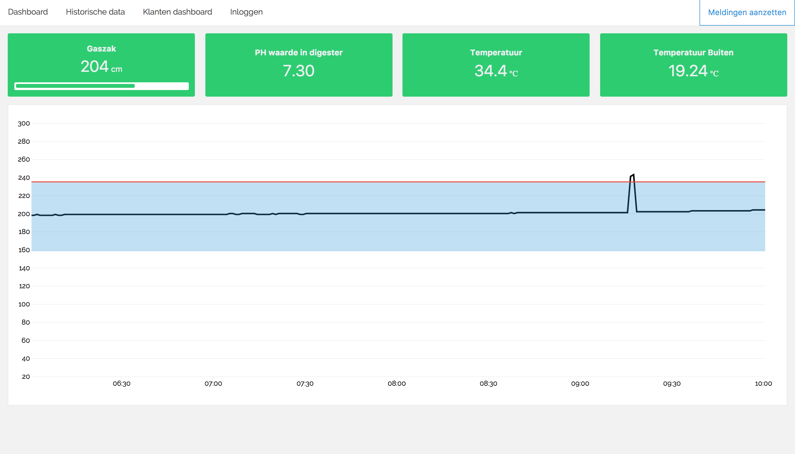
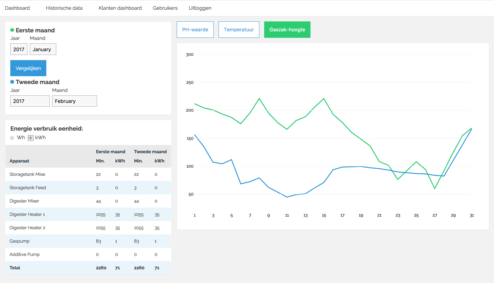

*This repository builds off of my students work as published [here](https://github.com/sjoerdbeentjes/biogasboot).*
# Biogasboot data visualization
The datavisualization in this repository has been built to provide an insight to the inner workings of the [Biogasboot](http://www.biogasboot.nl/) location in Amsterdam, The Netherlands. On this boat, food waste from the nearby [Restaurant de Ceuvel](http://deceuvel.nl/en/) is tranformed into methane gas which is reused in the kitchen. To achieve this, finely ground food leftovers are fed into the boat where they ferment. During this process, an array of sensors and self correcting feedback systems keep track of the in- and outflow of all the materials involved as well as their status (temperature, acidity, etc.)
Our Biogasboot data visualisation system visualizes this sensor data and the state of the system in an attempt to better understand the process and to allow operators to closely monitor and influence the fermentation process.
A live demo of this system can be found [here](https://bgb.spectral.energy/operator/dashboard)

## Usage
For now operators can see live visualizations of the data generated on the Biogasboot. The visualization shows all the values that are available. It is also possible to look at the historical data. The filter funcionality isn't finished yet though. There are multiple API endpoints that can be used to filter and format the data from the FTP server.

Administrators can register new accounts for other admins and operators. Soon a dashboard for Café de Ceuvel will follow, as well as a interactive website where users can learn more about the Biogasboot. See the ToDo list below for more functions to come!

## Technical setup
The easiest way to understand the setup of our system is to follow the data cycle.
1. Sensors on the boat gather data.
2. That data is sent to a [PLC](https://en.wikipedia.org/wiki/Programmable_logic_controller).
3. The registers of the PLC are read by a Raspberry Pi.
4. The rPi transforms the data into json objects which are sent to a Rabbit MQ server every minute.
5. The server publishes this real-time data on a websocket endpoint.
6. The endpoint is consumed by a node server application and an Influx DB listener.
    - The Influx DB listener archives the real-time data.
    - The node server translates the real-time stream into object that are stored on a MongoDB.
8. A front-end datavisualization node web app served by the node server app subscribes to the data in the MongoDB.
9. Updates are reflected in a real-time datavisualization while historical views show metrics and graphs of archived data downloaded from MongoDB.

## Datavisualization Features
- User system with roles (register and login)
- User management panel for administrators
- Dashboard for the operators with live visualized data from the Biogasboot
- Dashboard for searching and comparing Historical data, visualized in D3
- Dashboard with live visualizations for in Café de Ceuvel

## Screenshots
All views of the dashboard currently in the app



## ToDo
* [ ] Rewrite dashboard view to allow the user to select a date-range
* [ ] Clean up this repo (delete files like deprecated views)
* [ ] Have the dashboard use the API to load data, not directly from the MongoDB
* [ ] Add dates and labels to the axis of all charts
* [ ] Resolve deprecation warnings on startup
* [ ] Re-enable the service worker

## API Endpoints
The application has multiple API endpoints. This is an overview of all the possibilities.

**All data**
`/api/all`
This call returns an object with all the data that is available.

**Date Range data**
`/api/all?dateStart=1489720679&dateEnd=1490268059`
This call returns an object with all the data within the specified date-range The date has to be a UNIX timestamp. You declare the start- and end datel

**Data for a specific day**
`/api/all?format=d&date=1490400000`
This call returns the data of a specific day. All values are added up and the 'count' value can be used to divide the values to get the average of that day. This call needs an UNIX timestamp as date.

**Average per day in a specific range**
`/api/all?dateStart=1489720679&dateEnd=1490268059&format=d`
Get the average per day in a specific range. Use a UNIX timestamp as date, followed by `&format=d`

## Notifications with ServiceWorker (currently disabled)
As addition on the websockets we made a ServiceWorker that can send notifications to devices that are subscribed. This is very usefull when a warning state is triggered but the operator isn't watching is phone dashboard. The subscriptions are saved in the MongoDB database so when the server restarts the subscriptions aren't gone To send notifications we needed a GCM_API_KEY (Google Cloud Messaging).

The notifications are used for the real-time dashboard so the operator doesn't have to watch his phone all the time.

## Calculation with the data
The Biogasboot stores the data in a CSV file but this RAW data and we can't do everything with this that. Some stakeholder want a bundle of multiple values but those bundles aren't found in the CSV files.

### Usage calculations
The calculations we did are mostly found in modules/usage-calculation.js here is calculated how long a device is ON in 1 month. When we know how long it's ON we can calculate the energy usage in Wh and kWh. Those calculations are stored in an object and then pushed to the front-end. For every calculation there is a comment how the calculation is working.

## Config variables
The application makes use variables that aren't clear yet so we made a config file where all the different variables are stored.

The config can be founded in the folder "modules/config.js". Here you can define the following things:
 * The min, max, low, high values of a parameter like PH value or gasbag.
 * The above has impact on the tileStatus function that will define the state of a value.
 * Every device has it's own usage per hour this can also changed here.
 * When the control panel of the Biogasboot is connected to a FTP server you can also modify the FTP settings.

```javascript

// It can be included in front-end and backend files you only need to call the right function that you needed

// For backend modules
const config = require('./config');

// For front-end modules
const config = require('../../../modules/config');
```

## Build / Install and start project

### Clone this repo

```console
  git clone https://github.com/sjoerdbeentjes/biogasboot
  cd biogasboot
```

### Install the dependencies
```console
npm install
```

### Setup environment variables (.env)
```console
DB_URL=LEGACY_MONGO_DB
DB_URL_NEW=CURRENT_MONGO_DB
SPECTRAL_DB_URL=SPECTRAL_REALTIME_ENDPOINT
MQTT_USER=SPECTRAL_MQTT_USERNAME
MQTT_PASS=SPECTRAL_MQTT_PASSWORD
GCM_API_KEY=GCM_API_KEY_FROM_GOOGLE
FTP_SERVER=FTP_SERVER_IP
FTP_USER=FTP_LOGIN_USERNAME
FTP_PASS=FTP_LOGIN_PASSWORD
API_KEY=BIOGASBOAT_API_KEY
```

### Build CSS and JS
This will build the minified and cleaned CSS and JavaScript files.
```console
npm run build
```

### Start server
```console
npm start
```

### Start server with live updates
```console
npm run start-update
```

## Sources
- [De Biogasboot](http://www.biogasboot.nl/)
- [De Ceuvel](http://deceuvel.nl/nl/)

## Collaborators
[Diego Staphorst](https://github.com/djaygo), [Sjoerd Beentjes](https://github.com/sjoerdbeentjes), [Timo Verkroost](https://github.com/TimoVerkroost), and [Camille Sébastien](https://github.com/camille500) built the first version of this project as part of a minor at the [Hogeschool van Amsterdam](http://www.hva.nl/opleiding/communication-and-multimedia-design/communication-and-multimedia-design.html). Laurens Aarnoudse made all contributions in this fork of the project.